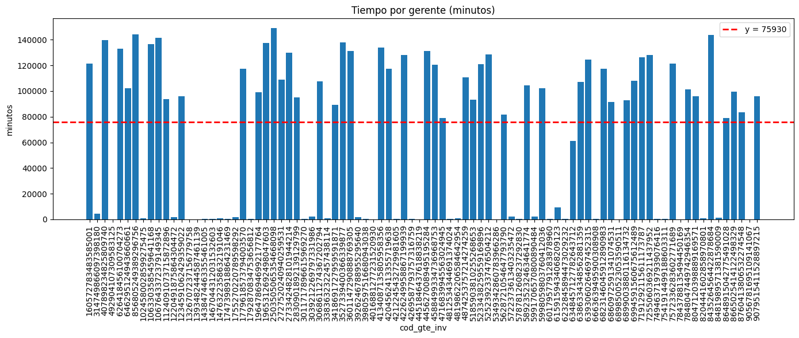
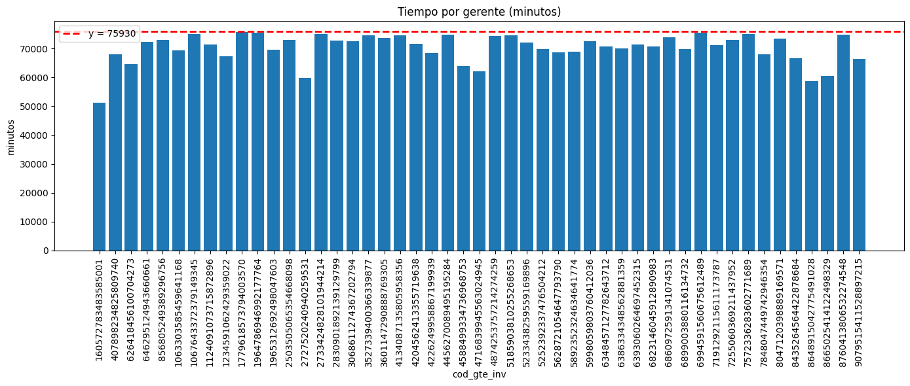

# bcol_prueba_2025

Este repositorio contiene datos y notebooks utilizados para una prueba/ejemplo de asignación y optimización.

Estructura del proyecto
------------------------

- `data/` - Conjuntos de datos en formato CSV usados por los notebooks:
	- `pcac_capacidad_gerentes.csv`
	- `pcac_clientes_tiempo_estimado.csv`
	- `pcac_encuesta.csv`
	- `pcac_mac_gpi_clientes.csv`
	- `pcac_mac_gpi_ecas.csv`
	- `pcac_mac_gpi_tenencia_prod.csv`
	- `pcac_oportunidades_comer.csv`
	- `pcac_planta_comercial2.csv`

- `notebooks/` - Notebooks Jupyter con el flujo de trabajo y ejemplos:
	- `load_csvs_from_metadata.ipynb` — carga y verificación de los CSVs usando metadatos; prepara los DataFrames para análisis posteriores.
	- `optimize.ipynb` — implementación y experimentación de modelos de optimización para asignación de recursos; contiene exploración de datos, definición del problema (restricciones y objetivo) y visualizaciones de resultados.
	- `pulp_example.ipynb` — ejemplo mínimo que muestra cómo usar la librería PuLP para formular y resolver un problema de programación lineal/entera.

- `data/entregables/` (o `entregables/`) - Resultados exportados generados por los notebooks, por ejemplo:
	- `entregables/resultado_prueba.csv`

Resumen breve de los notebooks
------------------------------

- `load_csvs_from_metadata.ipynb`
	- Objetivo: centralizar la carga de todos los CSV a partir de metadatos, normalizar nombres de columnas y realizar chequeos básicos (nulos, tipos, conteos).
	- Salida: DataFrames limpios listos para análisis y archivos intermedios opcionales.

- `optimize.ipynb`
	- Objetivo: construir y probar modelos de asignación/optimización (por ejemplo, minimizar tiempo o balancear carga entre gerentes) usando los conjuntos de datos preparados.
	- Contenido: definición de variables, restricciones (capacidades, tiempos estimados), ejecución del solver y generación de visualizaciones comparativas.

- `pulp_example.ipynb`
	- Objetivo: ejemplo pedagógico que muestra la sintaxis básica de PuLP y cómo formular un problema simple de asignación/optimización.

Cómo ejecutar (rápido)
----------------------

1. Crear y activar un entorno virtual (Windows PowerShell):

	 python -m venv .bcol_env
	 .\.bcol_env\Scripts\Activate.ps1

2. Instalar dependencias sugeridas (si aún no existen). Asumimos uso de pandas, numpy y pulp; adapte según sus notebooks:

	 pip install pandas numpy pulp jupyter

3. Abrir Jupyter Lab/Notebook en la raíz del proyecto y ejecutar las celdas de los notebooks:

	 jupyter lab

- `asignacion_cruda` muestra la asignación inicial (por ejemplo, asignación por orden o sin considerar restricciones/optimización).
- `asignacion_modelo` muestra la asignación resultante después de aplicar el modelo de optimización (resultado del notebook `optimize.ipynb`).

Comparativa y conclusión
- Calidad de la asignación: `asignacion_modelo` tiende a mostrar una distribución más equilibrada de carga entre gerentes y una mejor satisfacción de las restricciones (capacidades, tiempos máximos) en comparación con `asignacion_cruda`, que suele presentar sobrecarga en algunos agentes.
- Eficiencia: la versión del modelo normalmente reduce métricas objetivo (p. ej., tiempo total, coste o desviación respecto a capacidades) frente a la asignación cruda.
- Robustez y cumplimiento: `asignacion_modelo` suele respetar límites de capacidad y otras restricciones implementadas; `asignacion_cruda` puede violarlas o generar asignaciones subóptimas.

En resumen: si las suposiciones anteriores se cumplen, la imagen `asignacion_modelo` debería representar una mejora clara frente a `asignacion_cruda` en términos de balance, cumplimiento de restricciones y eficiencia del objetivo. 

ademas se presenta la asigancion de gerentes entre los datos crudos y la capacidad en tiempo de cada gerente (color rojo):

y la asignacion modelada de la prueba

